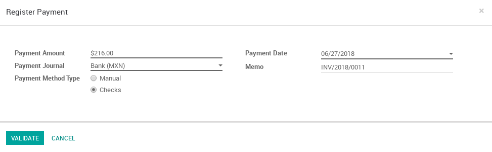
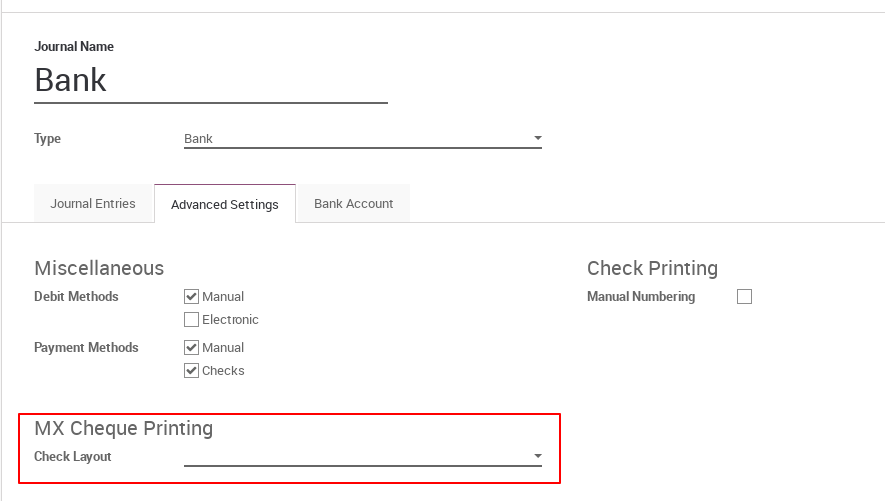

Mexico Check Printing
=====================

This module allows to print your payments on pre-printed check paper according
to the bank.

To use this module select `Checks` as Payment Method Type when register the
payment.

|

|

If you want to use a specific bank template to print the check you have to
select a `Check Layout` in the journal, a generic template will be used as
default. If you want to disable the printing option select 'None'.

|

|

Banks Available
---------------

The following is the list of the available banks templates:

- Banamex
- Bancomer
- HSBC
- Santander
- Scotia

