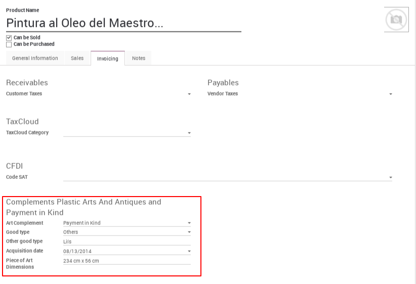

This module manages the following complements:

* Alienation of Plastic Arts and Antiques
* Payment in kind - Plastic Arts

Complement to Alienation of Plastic Arts and Antiques Mexican Localization
==========================================================================

Complement to incorporate information of Plastic Arts and Antiques in the CFDI
version 3.3

If the invoice generated is to a Plastic Arts or Antique, in the product must
be indicated that `is art`, and must be assigned the product information
that the CFDI require to this complement.

  .. figure:: ../l10n_mx_edi_eapa/static/src/product.png

All the fields are used in the CFDI to the complement. But the complement have
other attribute `Subtotal` that is used to indicate the acquisition price if
apply, to assign this value is used the `Cost` field in the product.

  .. figure:: ../l10n_mx_edi_eapa/static/src/product_price.png

For more information in the `SAT page <http://www.sat.gob.mx/informacion_fiscal/factura_electronica/Paginas/obrasarteantiguedades.aspx>`_.

Complement to Payment in Kind
=============================

Complement to incorporates information of Payment in Kind for issuance of tax
receipts for the donation in the fiscal facility of Payment in kind in CFDI 3.3.

To use this complement you have to set the following information:

- *CvePIC*, this is the registration key to the Register of Cultural Institutions
  attached to the Specified Payment Program. This is set in the Client's Internal
  Reference field.
- *FolioSolDon*, this is the folio number of the donation request. This is set
  in the Invoice's Referente/Description field.
- *PzaArtNombre*, this is the name of the piece of art, and it will be the Product's
  name.
- A product with Art Complement field selected as 'Payment in kind' must exists
  in the invoice lines so you can provide the following data in the Product's
  Invoicing page:

This data correspond to the complement's fields:

- *PzaArtTecn*, this is the technique used to produce the piece of art, and it
  can be set in 'Good type' field. Here you can select Others and use 'Other good
  type' to describe the art piece technique.
- *PzaArtAProd*, this is the year when the piece of art was produced. This is
  set in 'Acquisition date' field.
- *PzaArtDim*, this is the dimensions of the piece of art, this is set in the
  'Piece of Art Dimensions' field.

For more information in the `SAT page for Payment in Kind Complement <http://www.sat.gob.mx/informacion_fiscal/factura_electronica/Paginas/complemento_pagoenespecie.aspx>`_.
