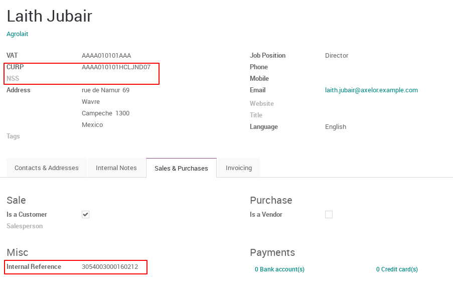
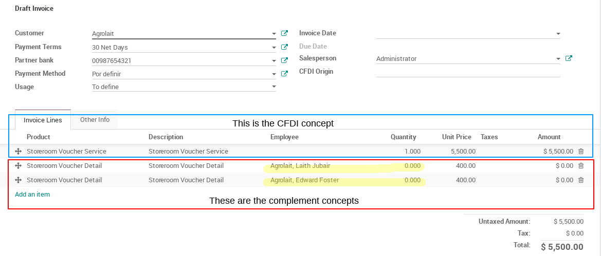

This module manages the Food Vouchers complement, which allows incorporating the
information issued by an electronic wallet service provider of food vouchers on
invoices.

This means that the supplier of electronic wallets is the one who uses this
complement to issue an invoice to the client company that provides its workers
with electronic vouchers. It will be necessary to specify the amounts of the
electronic vouchers for each employee of the client company, this is done in
the lines of the invoice, one line for each employee.

To use this complement:

- In the **invoice lines** you have to select some 'products' with an Employee 
  associated, this 'products' are the ones that are going to be added to the
  complement. All the Employee data needed can be set up in the *Partner model*.
- In this lines, you will set the vouchers Unit price ONLY (quantity should
  be zero), the unit price will be the amount which is the 'importe' of each
  Employee in the complement.
- Every Employee has to have an **identifier number** which is the electronic
  purse identifier and it is the 'identificador' at the 'Concepto' Node. And
  this is set in the 'Internal Reference' field.
- Also, every Employee have to a **CURP** number and optionally you can set the
  **Social Security Number**.

The following is an example of an Employee configuration as a Partner:

|

|

The following is an example of an Invoice:

|

|

**Optional Configurations**

- You can set the *registroPatronal* in the Client's Internal Reference field.

For more information in the `SAT page for Food Vouchers Complement <http://www.sat.gob.mx/informacion_fiscal/factura_electronica/Paginas/complemento_valesdespensa.aspx>`_.
