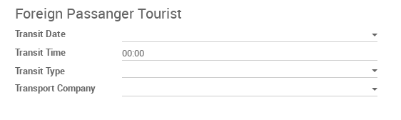
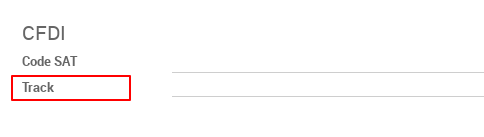

This module manages the Foreign Passenger Tourist complement, which allows to
incorporate to an invoice, the identification data of tourists or foreign
passengers.

To use this complement you should fill the following information on the Invoice:

**Where:**

- *Transit Date*, required to express the date of arrival or departure
  of the means of transport used, with the format aaaa-mm-dd (ex.: 2018-12-09).
- *Transit Time*, required to express the date of arrival or departure of the
  means of transport used, with the format hh:mm:ss (ex.: 17:09:00)
- *Transit Type*, required to express the operation performed.
- *Transport Company*, it is the transport company that enters it into national
  territory or transports it out.
- *Transport Id*, it is optional and express the identifier of the means of
  transport used, example: flight number. You can set this in the Invoice's
  Reference/Description field.

Also, the **Client** should be foreign it means the origin country has to be
different from your company country, so the following information is required:

- *TipoId*, it is the identification type is given by the client, like passport,
  social security number.
- *NumeroId*, it is the identification number.
- *Nacionalidad*, it is given by the Partner's Country field.

The fisrt two fields (TipoId and NumeroId) you have to set these in the Client's
Internal Reference field, with the format: TipoId|NumeroId (ex.: passport|1234567890)

And one **Product** should have the Track field filled, which is an attribute
required to express if it is via "Air", "Maritime" or "Terrestrial".

For more information in the `SAT page for Foreign Passenger Tourist Complement <http://www.sat.gob.mx/informacion_fiscal/factura_electronica/Paginas/complemento_turista.aspx>`_.
