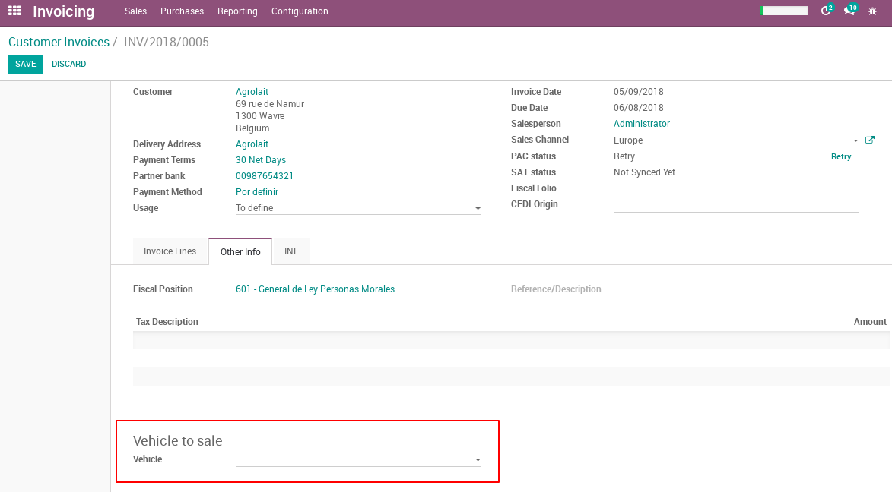
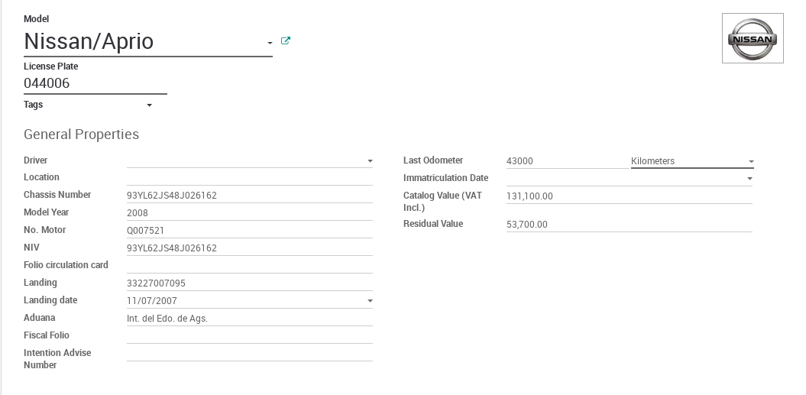

This module manages the following complements:

* Complement to Certificate of Destruction Mexican Localization
* Complement to Renewal and replacement of vehicle
* Complement to Sell Used Vehicles
* Complement to Natural Person member of the coordinated
* Concept Complement to Sell New Vehicles

To use one of this complement you should select it in your company settings:

  .. figure:: ../l10n_mx_edi_vehicle/static/src/company.png
     :align: center
     :width: 550pt

Complement to Certificate of Destruction Mexican Localization
==========================================================================

Complement to incorporate information about the certificate of destruction to
vehicles destroyed by the destruction centers authorized by the SAT in
the CFDI version 3.3

If the invoice is generated to a destruction, must be indicated the next
information in the invoice:

  .. figure:: ../l10n_mx_edi_vehicle/static/src/invoice.png
     :align: center
     :width: 550pt

**Where:**

 - *Complement Type* Is the complement you want to add to invoice. In this case
   you should select `Destruction Certificate`.
 - *Serie* Is assigned according to the type of vehicle distroyed.
 - *Folio* This value is assigned by the SAT to approve the destruction.
 - *Vehicle* Here is assigned the product to be distroyed, this record must
   have the information required to the complement. Here are required the
   next attributes:

    .. figure:: ../l10n_mx_edi_vehicle/static/src/vehicle.png
     :align: center
     :width: 500pt

**The vehicle require the next attributes:**

 - *Marca*: This value is taken from make in the vehicle model.
 - *TipooClase*: This value comes from the tag defined in the vehicle, if the
   record have many tags only take the first.
 - *Año*: This value comes from the `Model Year` in the vehicle.
 - *Modelo*: This value is the model name in the vehicle.
 - *NIV*: If the vehicle have a identification number, that value must be
   assigned in the field `NIV` of the vehicle.
 - *NumSerie*: This value comes from the field `Chassis Number` in the vehicle.
 - *NumPlacas*: This is the `License Plate` assigned in the vehicle.
 - *NumMotor*: This value comes from the field `No. Motor` in the vehicle.
 - *NumFolTarjCir*: This value comes from the field `Folio circulation card`
   in the vehicle.

 And if is imported:

 - *NumPedImp*: This is the value in the field `Landing`.
 - *Fecha*: This is the value in the field `Landing date`.
 - *Aduana*: This is the value in the field `Aduana`.

For more information in the `SAT page for Destruction Certificate Complement <http://www.sat.gob.mx/informacion_fiscal/factura_electronica/Paginas/certificadodedestruccion.aspx>`_.

Complement to Renewal and replacement of vehicle
==========================================================================

Complement to incorporate the information related to the incentives for the
renewal of the vehicular park of the motor carrier and by which measures are
granted for the replacement of motor vehicles of passage and cargo for the CFDI
version 3.3

If you want to add this complement to the invoice, you should indicate the next
information:

  .. figure:: ../l10n_mx_edi_vehicle/static/src/invoice_rsv.png
     :align: center
     :width: 550pt

**Where:**

  - *Complement Type* Is the complement you want to add to invoice. In this case
    you should select `Vehicle Renew and Substitution`.
  - *Vehicle* The transfer vehicle.
  - *Decree Type* Is the type of decree which is going to be apply
  - *Substitute Vehicle* Data of the used vehicle transferred by the licensee
    to the price of the new or pre-owned vehicle.

The vehicle requires the folowing information:

 - *Año*: This value comes from the `Model Year` in the vehicle.
 - *Modelo*: This value is the model name in the vehicle.
 - *NumPlacas*: This is the `License Plate` assigned in the vehicle.
 - *RFC*: Key of the Federal Register of Taxpayers. If the purchaser of the new
   or pre-owned vehicle is a financial leasing company.

The substitute vehicle requires the following information if Decree Type is
Renovation of the motor transport vehicle park:

  - *PrecioVehUsado*: This value comes from `Catalog Value` in the vehicle.
  - *TipoVeh*: Is a tag in tags and it should be one of this (with this
    format).
    - 01 - Fifth wheel tractor
    - 02 - Two axle trucks with a minimum weight of 11,794kg
    - 03 - Three axle trucks with a minimum weight of 14,500kg
    - 04 - Integral buses with a capacity of more than 30 seats
    - 05 - Conventional buses with a capacity of more than 30 seats
    - 06 - Vehicles for transportation of 15 people or more with age of more than 8 years
    - 07 - Platform or chassis for integral buses for more than 30 seats
    - 08 - Platform or chassis for conventional buses for more than 30 seats
  - *Marca*: This value is taken from make in the vehicle model.
  - *TipooClase*: This value comes from the tag defined in the vehicle, if the
    record have many tags only take the first.
  - *Año*: This value comes from the `Model Year` in the vehicle.
  - *NumPlacas*: This is the `License Plate` assigned in the vehicle.
  - *NumFolTarjCir*: This value comes from the field `Folio circulation card`
    in the vehicle.
  - *FolioFiscal*: Fiscal folio number of the CFDI issued by the Authorized
    Destruction Center to which the Vehicle Destruction Certificate complement
    has been added.

The substitute vehicle requires the following information if Decree Type is
Replacement of passenger and freight motor vehicles:

  - *PrecioVehUsado*: This value comes from `Catalog Value` in the vehicle.
  - *TipoVeh*: Is a tag in tags field and it should be one of this (with this
    format).
    - 01 - Fifth wheel tractor
    - 02 - Two axle trucks with a minimum weight of 11,794kg
    - 03 - Three axle trucks with a minimum weight of 14,500kg
    - 04 - Integral buses with a capacity of more than 30 seats
    - 05 - Conventional buses with a capacity of more than 30 seats
    - 06 - Vehicles for transportation of 15 people or more with age of more than 8 years
  - *Marca*: This value is taken from make in the vehicle model.
  - *TipooClase*: This value comes from the tag defined in the vehicle, if the
    record have many tags only take the first.
  - *Año*: This value comes from the `Model Year` in the vehicle.
  - *Modelo*: This value is the model name in the vehicle.
  - *NumPlacas*: This is the `License Plate` assigned in the vehicle.
  - *NumFolTarjCir*: This value comes from the field `Folio circulation card`
    in the vehicle.
  - *NumFolAvisoint*: This values comes from `Intention Advise Number` in the
    vehicle.
  - *NumPedIm*: This is the value in the field `Landing`.
  - *FechaRegulVeh*: This is the value in the field `Landing date`.
  - *Aduana*: This is the value in the field `Aduana`.

  - *FolioFiscal*: This value comes from `Fiscal Folio` in the vehicle.

**Final notes**

 - The required field `VehEnaj` for this complement, which values can be `New`
   or `pre-owned`, they are going to be determined by the `Last Odometer` field
   in the vehicle (Vehicle field on Invoice).

 - If the `Decree Type` is `Replacement of passenger and freight motor vehicles`
   the `Substitute Vehicle` can be just one, but if the `Decree Type` is
   `Renovation of the motor transport vehicle park` you can spacified more than
   one Used Vehicles.

For more information go to `SAT page for Vehicle Renew and Substitutin Complement <http://www.sat.gob.mx/informacion_fiscal/factura_electronica/Paginas/renovacionysustitucionvehiculos.aspx>`_.

Complement to Sell Used Vehicles
================================
Complement that allows incorporating information to taxpayers who sell new
vehicles to natural persons who do not pay in the terms of Sections I and II
of Chapter II of Title IV of the ISR law, and who receives in consideration as
a result of that alienation a used vehicle and money.

If you want to add this complement to the invoice, you should indicate the
following information.

**Where**

  - *Vehicle*: is the used vehicle

The vehicle requires the following information:

  - *montoAdquisicion*: This is the amount that was paid for the used vehicle,
    according to the purchase invoice. This correspond to the 'Catalog Value'
    field.
  - *montoEnajenacion*: This is the disposal amount of the used vehicle, and 
    this correspond to the 'Total' amount in the invoice.
  - *claveVehicular*: The used vehicle's vehicular code. It correspond to the
    'License Plate' field.
  - *marca*: This is the used vehicle brand and you can set this in the 'Model'
    field with the format 'Brand/Model'; ex.: Nissan/Aprio.
  - *tipo*: This is the used vehicle model, and you can set this in the 'Model'
    field with the format 'Brand/Model' like in the brand.
  - *modelo*: This is the used vehicle model year and you can set this in the
    'Model Year' field.
  - *numeroMotor*: This is the engine number of the used vehicle, and it 
    corresponds to the 'No.Motor' field.
  - *numeroSerie*: This is the chassis number and it corresponds to the field of
    the same name 'Chassis Number'.
  - *NIV*: This is the vehicular identification number of the used vehicle and
    it corresponds to the field of the same name 'NIV'.
  - *valor*: Attribute required to express the value of the vehicle, established
    in the EBC Guide or Blue Book (Guide to Information to Merchants of
    Automobiles and Trucks and Insurers of the Mexican Republic) in force,
    issued by the National Association of Dealers in Automobiles and Trucks new
    and used AC. This can be set in the 'Residual Value' field.
  - *numero*: This is the number of the customs document that supports the
    import of the good. This can be set in the 'Landing' field.
  - *fecha*: This is the date of issue of the customs document, and it can be
    set in the 'Landing date' field.
  - *aduana*: This specifies the customs through which the goods were imported, and
    it can be set in the 'Aduana' field.

The following is an example of a used vehicle to sell:

|

  .. warning:: It is important the vehicle odometer is set to ensure it is a used
     vehicle. If the vehicle odometer is not set it could generate conflicts with
     other complements.

Complement to Natural Person member of the coordinated
======================================================

It allows to incorporate to an invoice, the identification data of the vehicle
that corresponds to individuals who are members of the Coordinated Committee,
who choose to pay the tax individually in accordance with the provisions of
article 83, seventh paragraph of the Income Tax Law.

If you want to add this complement to the invoice, you should indicate the
following information:

**Where**
  - *Vehicle* The vehicle which is the object of taxes.

The vehicle requires the following information:

  - *ClaveVehicular* This is a code that is related to the vehicle version and
    it correspond to the 'NIV' field.
  - *Placa* This is the License Plate assigned in the vehicle.

For more information go to `SAT page for PFIC Complement <http://www.sat.gob.mx/informacion_fiscal/factura_electronica/Paginas/complemento_pfcoordinado.aspx>`_.

Concept Complement to Sell New Vehicles
=======================================

Complement concept that allows incorporating the manufacturers, assemblers or
authorized dealers of new vehicles, as well as those that import vehicles to
remain permanently in the northern border area of the country and in the States
of Baja California, Baja California Sur and the partial region from the State
of Sonora, to a Digital Tax Receipt through the Internet (CFDI), the vehicle
key that corresponds to the alienated version and the vehicle identification
number that corresponds to the alienated vehicle.

If you want to add this complement to the invoice, you should indicate the
following information:

**Where**
  - *Vehicle* The vehicle to be sale

The vehicle requires the following information:

  - *ClaveVehicular*  This is a code that is related to the vehicle version and
    it correspond to the license plate field.
  - *Niv* This is the vehicle identification number.

|

  .. warning:: It is important the vehicle odometer is set to '0' to ensure it 
     is a new vehicle. If the vehicle odometer is not set it could generate
     conflicts with other complements.

|

  .. tip:: If you want to add some extra parts when selling a new vehicle you
     should register a Cost in the Vehicle. The description field is where the
     following information is set:

      - Quantity
      - Unit
      - Identification number
      - Unit amount, this is the amount field in vehicle cost

     And the landing information like:

      - Landing document number
      - Landing date, this is the date field in vehicle cost
      - Landing place name

     This description field should have the following format:
     'extra part quantity/unit/landing document number/landing place name'

For more information go to `SAT page for VentaVehiculos Complement <http://www.sat.gob.mx/informacion_fiscal/factura_electronica/Paginas/complemento_venta_vehiculos.aspx>`_.
